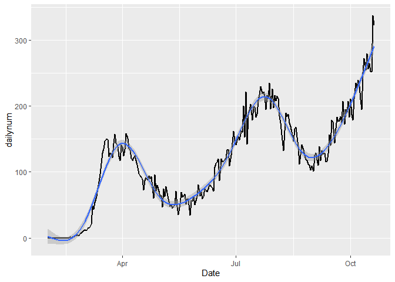

<!-- README.md is generated from README.Rmd. Please edit that file -->

# Covid19Map

<!-- badges: start -->

[](https://CRAN.R-project.org/package=Covid19Map)
[](https://www.tidyverse.org/lifecycle/#stable)
[](https://travis-ci.com/user/repo)
<!-- badges: end -->

The goal of Covid19Map is to download the Covid-19 time-series from
Johns Hopkins University Github page. There are three functions in this
package that can be used for getting a clean data, plotting a World-map
showing the number of cases and death in each day and a final figure
that shows time-series for any individual country during a user defined
interval.

## Installation

You can install the released version of Covid19Map from
[CRAN](https://CRAN.R-project.org) with:

``` r
install.packages("Covid19Map")
```

And the development version from [GitHub](https://github.com/) with:

``` r
# install.packages("devtools")
devtools::install_github("hojjatks/Covid19Map")
```

## Example

This is a basic example which shows you how to solve a common problem:

``` r
library(Covid19Map)
## basic example code
library(RCurl)
#> Warning: package 'RCurl' was built under R version 3.5.3
library(tidyverse)
#> Warning: package 'tidyverse' was built under R version 3.5.3
#> -- Attaching packages --------------------------------------------------- tidyverse 1.3.0 --
#> v ggplot2 3.3.2     v purrr   0.3.4
#> v tibble  3.0.4     v dplyr   1.0.2
#> v tidyr   1.0.2     v stringr 1.4.0
#> v readr   1.3.1     v forcats 0.5.0
#> Warning: package 'tidyr' was built under R version 3.5.3
#> Warning: package 'readr' was built under R version 3.5.3
#> Warning: package 'purrr' was built under R version 3.5.3
#> Warning: package 'stringr' was built under R version 3.5.3
#> Warning: package 'forcats' was built under R version 3.5.3
#> -- Conflicts ------------------------------------------------------ tidyverse_conflicts() --
#> x tidyr::complete() masks RCurl::complete()
#> x dplyr::filter()   masks stats::filter()
#> x dplyr::lag()      masks stats::lag()
library(ggplot2)
library(dplyr)
library(stringr)
library(lubridate)
#> 
#> Attaching package: 'lubridate'
#> The following objects are masked from 'package:base':
#> 
#>     date, intersect, setdiff, union
DataFrame<-GetFullTimeseries()
```

``` r
Covid19Map::PlotCountryTimeseries(FromDate="2020.2.1",
           ToDate="2020.10.20",
           Country="Iran",TypeP="New Death")
#> `geom_smooth()` using formula 'y ~ s(x, bs = "cs")'
```


